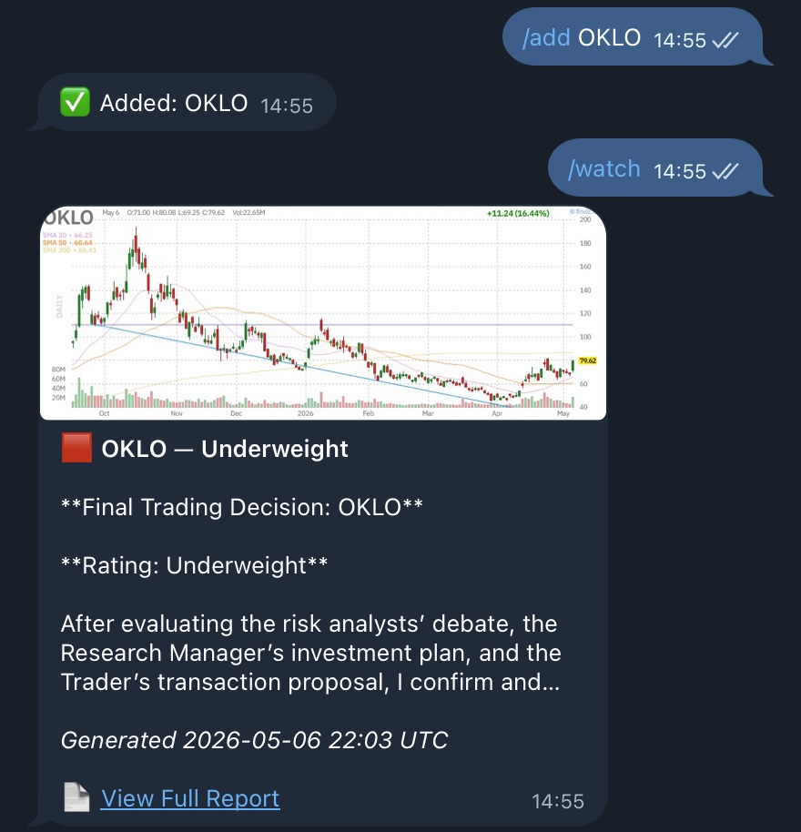
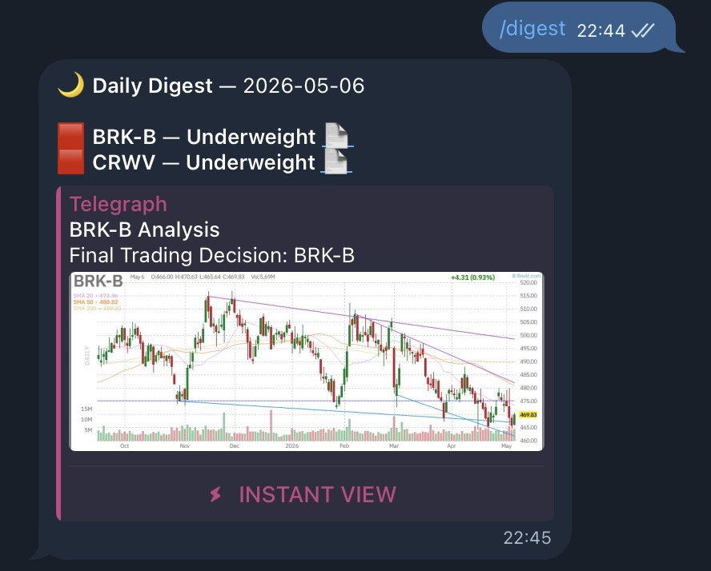
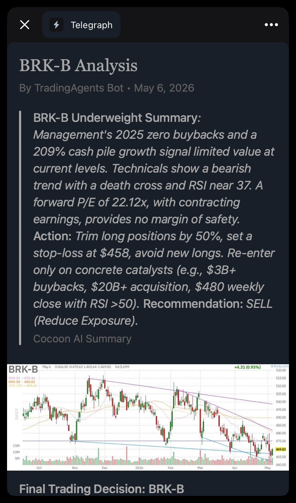

<div align="center">

# TradingAgents Telegram Bot

<br>


<br>

[](https://github.com/IvanWng97/TradingAgents-Telegram/actions/workflows/lint.yml)
[](https://github.com/IvanWng97/TradingAgents-Telegram/actions/workflows/docker-build.yml)
[](https://github.com/IvanWng97/TradingAgents-Telegram/actions/workflows/codeql.yml)
[](LICENSE)


[🚀 Features](#-features) • [🎬 Demo](#demo) • [📦 Install](#install) • [💬 Commands](#commands) • [⚙️ Configuration](#configuration) • [⚠️ Disclaimer](#disclaimer)

</div>

Telegram bot wrapping the [TradingAgents](https://github.com/TauricResearch/TradingAgents) framework. Curate a watchlist via Telegram, tap one or more tickers, and the bot runs `TradingAgentsGraph.propagate(...)` for each — replying with a finviz chart, the trade decision, a short summary, and a Telegraph link to the full analysis. Per-step pipeline progress streams back into the message caption while the analysis runs.

## 🚀 Features

- 🤖 **Multi-Agent Analysis**: Wraps [TradingAgents](https://github.com/TauricResearch/TradingAgents) — analyst → researcher → trader → risk-manager LLM agents collaborate on each ticker, output is a finviz chart + decision + Telegraph link.
- 📋 **Watchlist Management**: Curate tickers via `/add`, `/del`, `/watch`. Each is yfinance-validated; class-share dot forms (`BRK.B`) auto-correct to dash form (`BRK-B`).
- ⚡ **Parallel Execution**: Tap multiple tickers and they run in parallel, gated by `TG_BOT_MAX_CONCURRENT_ANALYSES`. Overflow shows `⏳ Queued` until a slot frees.
- 💾 **Same-day Result Cache**: Two users on the same `/config` tapping the same ticker = one LLM run, not two. `/watch` + the daily digest hitting the same ticker = one run, not two. `/refresh NVDA` forces a re-analysis when intraday data has shifted enough.
- ⏳ **Live Progress + Cancel**: Per-step pipeline progress streams back into the Telegram message caption. Each in-flight analysis carries a ❌ Cancel button — cancellation is checked at every LLM-call boundary so the abort is near-instant.
- 🌅 **Daily Digest**: `/digest` schedules a recurring run of a curated subset of your watchlist at any hour + IANA timezone — paginated multi-select picker, one summary message per day with a Telegraph link per ticker.
- 📜 **Analysis History**: `/history` browses every saved analysis by ticker → date and republishes to Telegraph on demand, with `← Back` round-trip navigation.
- 🤹 **Multi-LLM Provider**: OpenAI, DeepSeek, Anthropic, Google, xAI, Qwen, GLM, Ollama — per-user `/config` picks provider + deep-think + quick-think model independently. Quality knobs for `max_debate_rounds` (1/2/3) and reasoning effort (default/low/medium/high) let you trade cost for thoroughness; the chosen settings render under the chart caption.
- 🛡 **Production-grade**: `ALLOWED_USER_IDS` allowlist, atomic + `fsync` per-user JSON storage, multi-arch Docker image (`amd64` + `arm64`) daily-rebuilt to track upstream, CodeQL `security-extended` + Trivy scanning, provenance + SBOM attestations.

## Demo

Sample published analysis: [BRK-B — 2026-05-05](https://telegra.ph/BRK-B-Analysis-05-05-2). Each `Run` from `/watch` produces a Telegraph page like this — chart + decision + multi-agent rationale.

<div align="center">

| `/add` + `/watch` analysis | `/digest` daily summary | Telegraph Instant View |
|:---:|:---:|:---:|
|  |  |  |

</div>

## Install

```bash
bash <(curl -fsSL https://raw.githubusercontent.com/IvanWng97/TradingAgents-Telegram/main/start.sh)
```

Prompts for your bot token, Telegram user ID, Telegraph token (auto-creates one if you skip), and an LLM provider + key. Drops a configured `.env` + [`docker-compose.yml`](./docker-compose.yml) into `./tradingagents-telegram`, pulls the [prebuilt image](https://hub.docker.com/r/ivanwng97/tradingagents-telegram), and prints the `docker-compose up -d` to run next.

Prefer to do it by hand? See [`docs/MANUAL_INSTALL.md`](./docs/MANUAL_INSTALL.md).

### First-time setup in Telegram

After `docker-compose up -d`, message your bot — `/start` walks you through the in-Telegram setup (`/config` → `/add` → `/watch`). If `/start` replies *"Not authorized. Your user ID is …"* the auth gate rejected you: add that ID to `ALLOWED_USER_IDS` in `.env`, then `docker-compose up -d` to restart and retry.

> ⚠️ **Leaving `ALLOWED_USER_IDS` empty makes the bot open to anyone who finds your bot handle, and they will burn your LLM tokens.** Set it.

### Cost expectations

Each analysis runs ~12 LLM calls across the agent pipeline. Per-ticker rough estimates: `deepseek-v4` ≈ $0.01, `gpt-4o` ≈ $0.20, `claude-sonnet-4` ≈ $0.40. Tapping `✅ Done` on a 10-ticker selection can easily hit single-digit dollars in minutes — pick your provider accordingly. The `/digest` filter exists partly so you can run cheap providers across a long watchlist daily without surprise bills.

### Upgrade later

```bash
docker-compose pull && docker-compose up -d
```

The image is rebuilt automatically by a daily GitHub Action whenever upstream [`tradingagents`](https://github.com/TauricResearch/TradingAgents) advances; the cron skips the build when the SHA hasn't changed, so you only pull a new image when there's actually new upstream code.

## Commands

| Command | Description |
|---|---|
| `/start`, `/help` | Welcome / help text |
| `/add NVDA AAPL TSLA` | Bulk-add tickers. Each is validated against yfinance — invalid symbols are rejected with a hint, US class-share dot forms (`BRK.B`) auto-correct to dash form (`BRK-B`). |
| `/add` (no args) | Bot prompts; reply with the ticker(s) you want to add |
| `/del NVDA AAPL` | Bulk-remove |
| `/del` (no args) | Inline-button picker — tap ❌ on each ticker, `✅ Done` to close |
| `/list` | Read-only text view of your watchlist with digest enrolment markers (🔔). Shows ticker count, daily digest schedule + enrolled subset (`K of N enrolled`), and a 4-column grid. No buttons — use `/watch` to actually run an analysis. |
| `/watch` | Paginated select-mode keyboard (9 per page). Tap any ticker to toggle (✅ prefix), use `✓ Select all` / `✗ Clear` for bulk, then `✅ Done (N)` runs the selected ones. Single ticker uses the cached graph; 2+ run in parallel up to `TG_BOT_MAX_CONCURRENT_ANALYSES`. Each in-flight analysis has its own ❌ Cancel button. |
| `/config` | Five-step picker: provider → deep model → quick model → debate rounds (1/2/3) → reasoning effort (default/low/medium/high). Higher rounds = more nuanced thesis (~1.5–2× cost); higher effort = deeper thinking on reasoning-capable models. Effort step is auto-skipped for providers without a thinking knob (DeepSeek, Qwen, GLM, Ollama, xAI). `❌ Cancel` at any step rolls back to your prior settings |
| `/digest` | Schedule a daily run of a curated subset of your watchlist. Single-screen picker: 24-hour grid + 10 IANA time zones (Pacific, Eastern, UTC, GMT/BST, JST, …) + a `📋 Tickers (N/M)` filter screen with a 3×3 paginated multi-select. One summary message per day, one Telegraph link per ticker. `▶ Run now` triggers an ad-hoc fan-out; `🔕 Off` disables (preserves hour, tz, and tickers for one-tap re-enable). New users start with an empty filter and must opt in. Auto-disables itself if you block the bot. |
| `/history` (no args) | Inline-button picker of all tickers with saved analyses |
| `/history NVDA` | Inline-button picker of recent analysis dates. `← Back` returns to the ticker picker. |
| `/history NVDA 2026-04-15` | Direct lookup — publishes that day's saved analysis to Telegraph |
| `/refresh NVDA` | Direct fast-path: drop today's cached result for `NVDA` and re-run the analysis. |
| `/refresh` (no args) | Same paginated multi-select picker as `/watch`, but the Done button is `🔄 Refresh (N)` and tapping it drops today's cache for each selected ticker before running. Useful when several tickers' intraday data has shifted and you want to refresh them in one shot. |
| `/status` | Operational snapshot: uptime, # analyses since boot, graph-pool size, your current LLM config |

The Telegram client also exposes a Menu button next to the input field with the same commands (populated via `set_my_commands`), and `/`-autocomplete works after typing the first letter or two.

## Configuration

All env vars — required secrets and tuning knobs — live in [`docs/CONFIGURATION.md`](./docs/CONFIGURATION.md). The four required secrets are pre-templated in [`.env.example`](./.env.example).

## Troubleshooting

Common startup / runtime issues and fixes: [`docs/TROUBLESHOOTING.md`](./docs/TROUBLESHOOTING.md).

## More

- [`docs/MANUAL_INSTALL.md`](./docs/MANUAL_INSTALL.md) — manual Docker setup if you'd rather not run `start.sh`.
- [`docs/CONFIGURATION.md`](./docs/CONFIGURATION.md) — env vars (required + tuning) and supported LLM providers.
- [`docs/DEVELOPMENT.md`](./docs/DEVELOPMENT.md) — local dev setup, pre-commit, smoke tests.
- [`docs/TODO.md`](./docs/TODO.md) — roadmap items not yet started.
- [`CLAUDE.md`](./CLAUDE.md) — architecture notes, key contracts, and current limitations.

## Disclaimer

This bot wraps the [TradingAgents](https://github.com/TauricResearch/TradingAgents) research framework — output is generated by LLMs and is **not investment advice**. Decision quality depends on the provider and deep / quick models you pick in `/config`, the yfinance data window the agents see, and the day's market noise; agents can hallucinate, contradict themselves, or miss context the prompts didn't surface. The same-day cache reuses a morning run for later taps on the same ticker — if intraday data has shifted, use `/refresh`. Use as a research aid only, do your own due diligence before acting on any signal, and don't run `/digest` on tickers you'd let it trade unsupervised. The author and contributors accept no liability for decisions made using this software.
